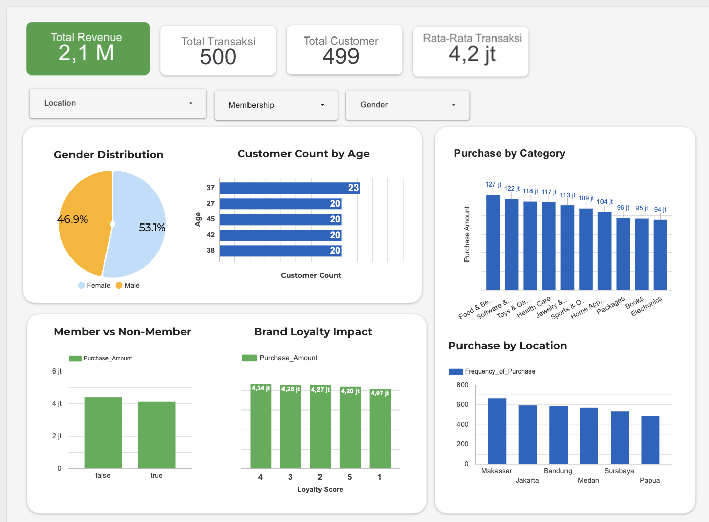

# SuryaHub Customer Behavior Analysis
**Data-Driven Strategies to Increase Revenue per Customer (Juli 2025)**

## 1. Business Problem
As SuryaHub prepares its marketing strategy for July 2025, the marketing team needs data-driven evidence to support key business decisions. The primary objective is to determine whether the existing loyalty program effectively increases customer purchase frequency and spending. If not, the analysis aims to identify the customer segments that should be prioritized to maximize future revenue.

## 2. Data & Tools
- **Dataset:** A dataset of 500 SuryaHub transactions collected in June 2025. The dataset includes customer demographics, purchase history, loyalty status, transaction channels, purchase intent, and social media influence, providing a comprehensive view of customer behavior and purchasing patterns.
- **Tools:** SQL (BigQuery), Looker Studio

## 3. Scorecard

| Metrics | Score |
|---|---|
| Total Revenue | Rp 2,1 M |
| Total Transactions | 500 |
| Total Customer | 499 |
| Average Transactions | Rp 4,2 jt |

## 4. Key Findings

### A. The Loyalty Program Is Not Effectively Increasing Customer Value
| Status | Avg Spending | Frequency |
|---|---|---|
| Member (TRUE) | Rp 4.104.058 | 6,68x |
| Non-Member (FALSE) | Rp 4.375.335 | 6,99x |
| **Difference** | **Rp 271.277 lower (member)** | **0,31x lower (member)** |

Non-members spend more and purchase more frequently than members, indicating that the current loyalty program does not effectively drive customer value. This finding is reinforced by the Brand Loyalty Score analysis: among customers with the highest loyalty score (5), 60 never used discounts, while only 46 did, suggesting that discounts are not the primary driver of customer loyalty at SuryaHub.

### B. High Spender ≠ High Loyalty
6 of 10 highest-spending customers have a Brand Loyalty Score of 3 or below. Notably, the two highest spenders (over IDR 7.7 million) both have the lowest loyalty score (1), indicating that the current loyalty score does not accurately reflect customers' economic value.

### C. Geografi
Makassar has the largest customer base (95), surpassing Jakarta (89), Bandung (82), Surabaya (78), and Medan (78), challenging the common assumption that Jakarta is the primary e-commerce market. Additionally, the top 10 highest-spending customers are geographically diverse, spanning Bandung, Surabaya, Makassar, Jakarta, and Papua, indicating that high-value customers are not concentrated in a single region.

### D. Purchase Intent
- **Impulsive** → average spending **lowest** (challenging the common assumption that impulsive buyers are the most responsive to promotions.)
- **Planned** → average spending **highest**
- **Need-based** → This segment has the second-highest average spending and the highest purchase frequency, accounting for approximately 26% of all transactions.

### E. Channel
- **Mixed Channel** (online + offline) → This segment has the highest average spending and contributes the largest share of total transactions (36.4%).
- **In-Store** → This segment has the highest purchase frequency, averaging 7.14 transactions per customer and accounting for 31.2% of all transactions.
- **Online** → Contributing 32.4% of total transactions

### F. Social Media Influence
Customers with high social media influence generated approximately IDR 582 million in total sales, compared with IDR 495 million for those with no social media influence. However, the difference is not substantial enough to conclude that social media is the primary driver of transaction value, indicating that further analysis is required.

## 5. SQL Queries

Query lengkap (6 query, mencakup demografi, geografi, loyalty program, high-value customers, purchase intent, dan channel) ada di [`sql/queries.sql`](./sql/queries.sql) — semuanya sudah diverifikasi hasilnya cocok dengan angka di laporan.

Contoh query kunci — perbandingan member vs non-member:

```sql
SELECT
    Customer_Loyalty_Program_Member,
    AVG(Purchase_Amount) AS avg_amount,
    AVG(Frequency_of_Purchase) AS avg_frequency
FROM Salinan_dari_Data_SuryaHub sddsh
GROUP BY Customer_Loyalty_Program_Member;
```

10 pelanggan dengan total pembelian tertinggi:

```sql
SELECT
    Customer_ID,
    SUM(Purchase_Amount) AS total_spent,
    MAX(Location) AS Location,
    MAX(Purchase_Channel) AS Channel,
    MAX(Brand_Loyalty) AS Brand_Loyalty
FROM Salinan_dari_Data_SuryaHub sddsh
GROUP BY Customer_ID
ORDER BY total_spent DESC
LIMIT 10;
```

## 6. Recommendations
1. Redesign the loyalty program by replacing the membership-based model with a spending-tier system (Bronze, Silver, Gold) and offering non-discount benefits such as early sale access, free shipping, and priority support.
2. Launch a regional marketing pilot in Makassar, leveraging its largest customer base with localized campaigns instead of a one-size-fits-all national strategy.
3. Strengthen cross-channel engagement by promoting services such as Click & Collect and providing incentives for single-channel customers to adopt omnichannel purchasing.
4. Prioritize Planned and Need-Based Buyers by investing in detailed product reviews, real-time inventory visibility, and product bundling while reducing reliance on flash-sale promotions.

## 7. Dashboard
[Lihat Dashboard di Looker Studio](https://datastudio.google.com/reporting/03f00b27-4c4c-423a-8007-570908670c09)



---
**Author:** Alfian Afriansyah · alfianafriansyah@gmail.com
